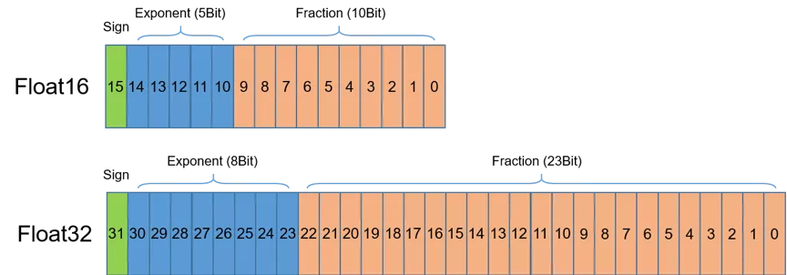
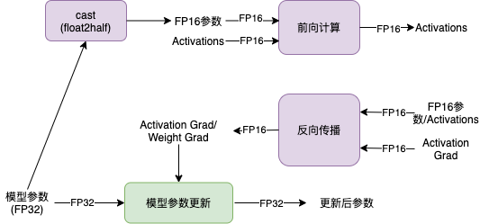
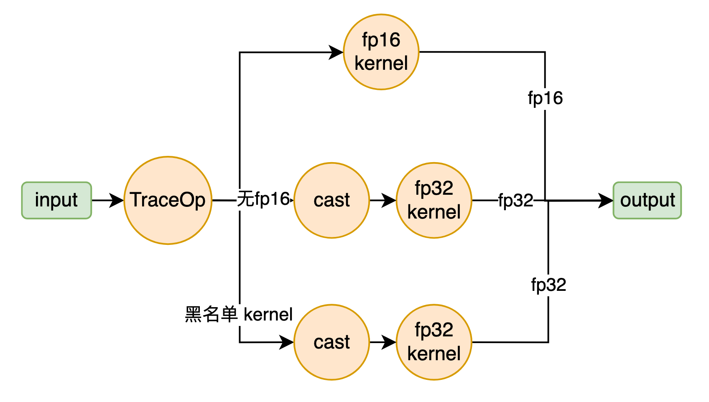

# 自动混合精度训练
**摘要:** 传统上，深度学习训练通常使用32比特双精度浮点数FP32作为参数、梯度和中间Activation等的数据存储格式。使用FP32作为数据存储格式，每个数据需要4个字节的存储空间。为了节约显存消耗，业界提出使用16比特单精度浮点数FP16作为数据存储格式。使用FP16作为数据存储格式，每个数据仅需要2个字节的存储空间，相比于FP32可以节省一半的存储空间。除了降低显存消耗，FP16格式下，计算速度通常也更快,因此可以加速训练。  
  
单精度浮点训练可以带来以下好处：  
1. 减少对GPU显存的需求，或者在GPU显存保持不变的情况下，可以支持更大模型和更大的batch size；
2. 降低显存读写的带宽压力；
3. 加速GPU数学运算速度 (需要GPU支持[1])；按照NVIDA数据，GPU上FP16计算吞吐量是FP32的2~8倍[2]。  

## 一、半精度浮点类型 FP16
首先介绍半精度（FP16）。如下图所示，半精度浮点数是一种相对较新的浮点类型，在计算机中使用2字节（16比特）存储。在IEEE 754-2008标准中，它亦被称作binary16。与计算中常用的单精度（FP32）和双精度（FP64）浮点类型相比，因为FP16表示范围和表示精度更低，因此FP16更适于在精度要求不高的场景中使用。  

  
  

  
## 二、NVIDIA GPU的FP16算力
在使用相同的超参数下，混合精度训练使用半精度浮点（FP16）和单精度（FP32）浮点即可达到与使用纯单精度训练相同的准确率，并可加速模型的训练速度。这主要得益于英伟达推出的Volta及Turing架构GPU在使用FP16计算时具有如下特点：  
- FP16可降低一半的内存带宽和存储需求，这使得在相同的硬件条件下研究人员可使用更大更复杂的模型以及更大的batch size大小。
- FP16可以充分利用英伟达Volta及Turing架构GPU提供的Tensor Cores技术。在相同的GPU硬件上，Tensor Cores的FP16计算吞吐量是FP32的8倍。  
  
## 三、混合精度训练原理
paddle支持两种混合精度训练模式：AMP和pure fp16，用户可以方便地使用这两种混合精度训练模型。  
  
### 1、AMP原理
使用AMP训练时，模型参数使用单精度浮点格式存储，在实际计算时，模型参数从单精度浮点数转换为半精度浮点数参与前向计算，并得到半精度浮点数表示中间状态和模型的loss值，然后使用半精度浮点数计算梯度，并将参数对应的梯度转换为单精度浮点数格式后，更新模型参数。计算过程如下图所示。  

  
  

  

  
通常半精度浮点数的表示范围远小于单精度浮点数的表示范围，在深度学习领域，参数、中间状态和梯度的值通常很小，因此以半精度浮点数参与计算时容易出现数值下溢，即接近零的值下溢为零值。为了避免这个问题，通常采用loss scaling机制。具体地讲，对loss乘以一个称为loss_scaling的值，根据链式法则，在反向传播过程中，梯度也等价于相应的乘以了loss_scaling的值，因此在参数更新时需要将梯度值相应地除以loss_scaling的值。
  
然而，在模型训练过程中，选择合适的loss_scaling的值是个较大的挑战。因此，需要采用一种称为动态loss scaling的机制。用户只需要为loss_scaling设置一个初始值：init_loss_scaling。在训练过程中，会检查梯度值是否出现nan或inf值，当连续incr_every_n_steps次迭代均未出现nan和inf值时，将init_loss_scaling的值乘以一个因子：incr_ratio；当连续decr_every_n_steps次迭代均出现nan和inf值时，将init_loss_scaling的值除以一个因子：decr_ratio。  
  
同时，某些算子不适合采用半精度浮点数参与计算，因为这类算子采用半精度浮点数进行计算容易出现nan或者inf值。为了解决这个问题，通常采用黑名单和白名单机制。其中，黑名单中放置不宜采用半精度浮点数进行计算的算子，白名单中放置适合采用半精度浮点数进行计算的算子。  

### 2、pure fp16原理

pure fp16 相比 amp 存在一些区别，在pure fp16 模式下，网络模型几乎所有的参数都是 fp16 类型的数据（只有BatchNorm、LayerNorm的参数会保持fp32），与 AMP 的策略不同，pure fp16 在训练循环函数执行之前，即对网络进行改写，将网络的参数转换为 fp16 数据类型。在执行时，如下图所示，pure fp16策略保证无fp16的kernel执行在fp32下，保证用户指定的黑名单kernel执行在fp32下，保证batchnorm/layernorm这类特殊的op仅仅输入输出为fp16，并使用 master weight 策略在持有 fp16 类型参数的同时，再生成一份对应的 fp32 类型的参数，在 optimizer 更新过程中使用 fp32 类型进行更新，避免性能变差或是收敛变慢的问题。同样，pure fp16也采用和 amp 一样的 loss scaling 策略。  

  
  

